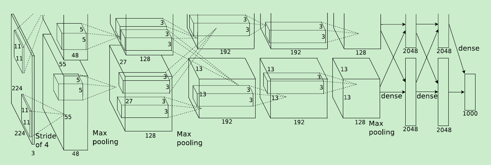
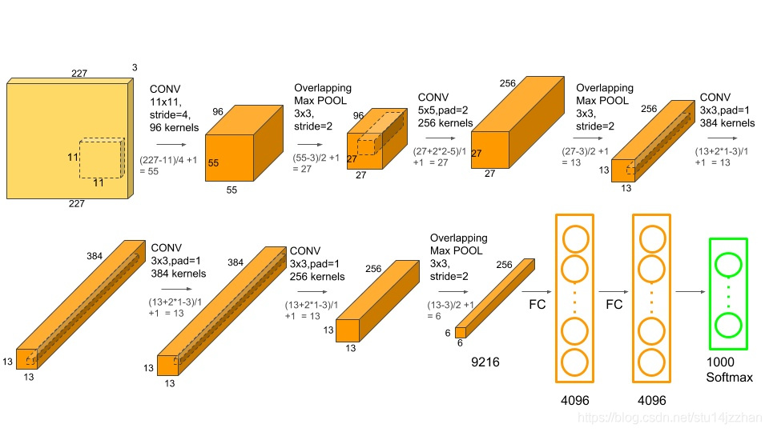
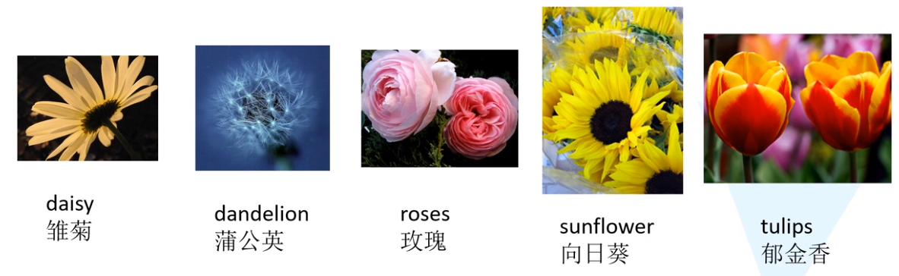
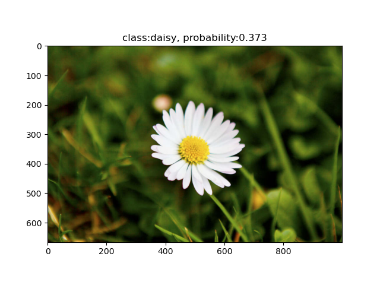
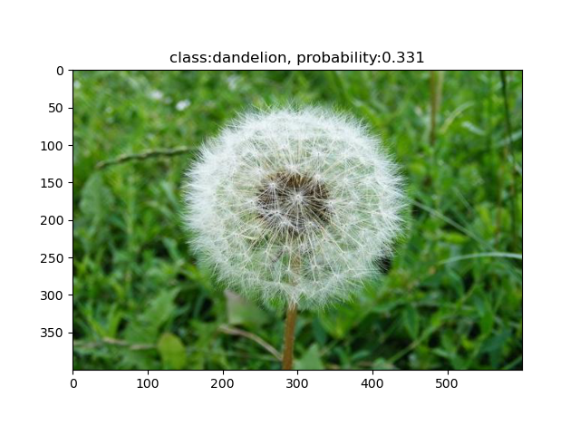
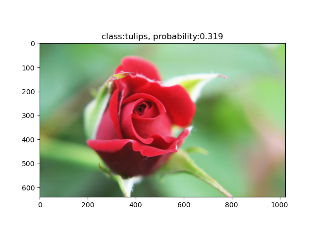
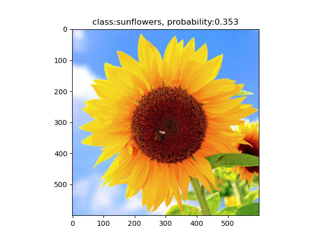
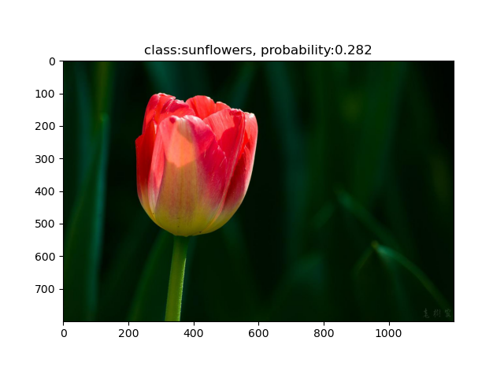

# AlexNet

## 论文网络结构
  
网络包含8层，前5层为卷积层，后3层为全连接层。  
论文附图的几个问题：
- 输入图像尺寸应为227
$$ M=\lfloor\frac{N-kernelsize+2*padding}{stride}+1\rfloor$$
- 采用双GPU训练，结构可以整合
- 结构可以细化  

## 细化后的网络结构 
  

## AlexNet的细节
### 激活函数
不同于以往常用sigmoid函数以及tanh函数，alexnet采用了relu函数作为激活函数
$$f(x)=\max(0,x)$$
优点：
- 减少训练时间
- 减缓梯度消失的现象
### Local Response Normalization
标准化采用Local Response Normalization，目的是为了提升泛化能力，在AlexNet
中, 只在第1层卷积层和第2个卷积层经过relu激活函数之后使用  
LRN受神经生物学中“横向抑制”概念启发，即**被激活的神经元抑制相邻的神经元**  
$$b^i_{x,y}=a^i_{x,y}/(k+a\sum^{\min(N-1,i+n/2)}_{j=\max(0,i-n/2)}(\alpha^i_{x,y})^2)^\beta$$  
论文采用的超参数（由验证集确定）：  
$$k=2,n=5,\alpha=10^{-4},\beta=0.75$$  
优点：  
- 有助于收敛更快
- 对局部神经元活动创造竞争机制，使其中响应比较大的值变得相对更大，抑制其他响应小的神经元，**不同神经元的相对大小的差距变得更大**
> 补充：  
> 神经网络学习过程本质就是为了学习数据分布，一旦训练数据与测试数据的分布不同，那么网络的泛化能力也大大降低；另外一方面，一旦每批训练数据的分布各不相同(batch 梯度下降)，那么网络就要在每次迭代都去学习适应不同的分布，这样将会大大降低网络的训练速度，这也正是为什么我们需要对数据都要做一个归一化预处理的原因。深度网络的训练是复杂的过程，只要网络的前面几层发生微小的改变，那么后面几层就会被累积放大下去。一旦网络某一层的输入数据的分布发生改变，那么这一层网络就需要去适应学习这个新的数据分布，所以如果训练过程中，训练数据的分布一直在发生变化，那么将会影响网络的训练速度  

### 重叠池化
不同于lenet中的平均池化层，alexnet采用了最大池化层，并且是有重叠的最大池化，即
$$stride<kernelsize$$
论文采用的参数为
$$stide=2，kernelsize=3$$
优点：
- 轻微防止过拟合
### 防止过拟合的策略(trick)
#### 数据增强
alexnet中采用两种数据增强的策略
1. 从256x256的原图中随机提取224x224的图片以及水平翻转，数据集扩大了2048倍
   $$2048=(256-224)*(256-224)*2$$
   即一张256x256的图像随机裁剪出224x224的图像有$(256-224)*(256-224)$种可能，再做一次水平翻转则有$(256-224)*(256-224)*2=2048$种可能
2. 改变训练集图片RGB通道的强度，在此之前需要对原始RGB图像进行主成分分析
   $$[I^R_{xy},I^G_{xy},I^B_{xy}]^T=[I^R_{xy},I^G_{xy},I^B_{xy}]^T+[\bm{p_1,p_2,p_3}][a_1\lambda_1,a_2\lambda_2,a_3\lambda_3]^T$$
   $p_i,\lambda_i$为RGB像素值的3x3协方差矩阵，$a_i$是均值为0标准差为0.1的高斯扰动
   个人推测应该是先对RGB图像resize成3x(256x256)，归一化后根据协方差公式得到3x3矩阵，再利用奇异值分解得到特征值$\lambda$和特征向量$\bm{p}$
#### dropout
alexnet在前两层全连接层前使用了dropout，以0.5的概率使得每个隐藏层的神经元输出0，既不参与前向传播，也不参与反向传播。这种方法弱化了神经元之间的依赖性。
### 训练策略
大约90个epoch
#### 权重更新：
$$v_{i+1}=0.9\cdot v_i-0.0005\cdot lr \cdot w_i-lr\cdot (\frac{\partial L}{\partial w}|_{w_i})_{D_i}$$
$$w_{i+1}=w_i+v_{i+1}$$
$i$为迭代次数，$v$是动量值，$lr$是学习率，$(\frac{\partial L}{\partial w}|_{w_i})_{D_i}$是损失函数关于$w$对$w_i$求值的导数在第$i$个批次上的平均值
#### 权重初始化
- 采用均值为0，标准差为0.01的高斯分布初始化各层参数  
- 第2、4、5个卷积层以及全连接层的偏置初始化为1，其余层偏置初始化为0
#### 学习率调整
- 初始化学习率为0.01
- 验证集错误率不再下降时，学习率除以10

---

## 代码部分
### 数据集
数据集包含5种类型花的图片，每张分别有600-900张不等，图像尺寸大小不一
数据集下载地址：http://download.tensorflow.org/example_images/flower_photos.tgz
  
#### 数据集划分代码

`
split_data.py
`
```
import os
from shutil import copy, rmtree
import random


def make_dir(file_path):
    if os.path.exists(file_path):
        # 如果文件夹存在，则先删除原文件夹再创建
        rmtree(file_path)
    os.makedirs(file_path)


def split_data(input_file_path, output_file_path, split_rate, seed='random'):
    if seed == 'fixed':
        random.seed(0)
    else:
        random.seed()
    # 获取当前文件路径
    cwd = os.getcwd()
    input_dataset_path = os.path.join(cwd, input_file_path)
    output_dataset_path = os.path.join(cwd, output_file_path)
    assert os.path.exists(input_dataset_path), f"path '{input_dataset_path}' does not exist."
    # ===================#######################################
    # os.listdir() 方法用于返回指定的文件夹包含的文件或文件夹的名字的列表
    # os.path.isdir() 方法用于判断某一路径是否为目录
    # 先遍历dataset_path获得文件\文件夹名称列表，再判断名称是否为目录
    ############################################################
    dataset_classes = [dataset_class for dataset_class in os.listdir(input_dataset_path) if
                       os.path.isdir(os.path.join(input_dataset_path, dataset_class))]
    # 训练集
    train_path = os.path.join(output_dataset_path, 'train')
    make_dir(train_path)
    for dataset_class in dataset_classes:
        make_dir(os.path.join(train_path, dataset_class))
    # 验证集
    val_path = os.path.join(output_dataset_path, 'val')
    make_dir(val_path)
    for dataset_class in dataset_classes:
        make_dir(os.path.join(val_path, dataset_class))

    for dataset_class in dataset_classes:
        input_dataset_class_path = os.path.join(input_dataset_path, dataset_class)
        images = os.listdir(input_dataset_class_path)
        images_num = len(images)
        # 随机选取验证集
        val_images = random.sample(images, k=int(images_num * split_rate))
        for index, image in enumerate(images):
            # 获取图像路径
            image_path = os.path.join(input_dataset_class_path, image)
            if image in val_images:
                # 将图像文件copy到验证集对应路径
                copy(image_path, os.path.join(val_path, dataset_class))
            else:
                copy(image_path, os.path.join(train_path, dataset_class))
            print(f'[{dataset_class}] is processing: {index + 1}/{images_num}')
    print('process finished.')


'''
文件结构示例：
|-- split_data.py
|-- flower_photos
    |-- daisy
    |-- dandelion
    |-- roses
    |-- sunflowers
    |-- tulips
    |-- LICENSE.txt
|-- data
    |-- train
        |-- daisy
        |-- dandelion
        |-- roses
        |-- sunflowers
        |-- tulips
    |-- val
        |-- daisy
        |-- dandelion
        |-- roses
        |-- sunflowers
        |-- tulips    
'''
if __name__ == '__main__':
    original_data_file_path = 'flower_photos'
    spilit_data_file_path = 'data'
    split_rate = 0.1
    split_data(original_data_file_path, spilit_data_file_path, split_rate)

```
将数据集图片随机划分为训练集、验证集
#### alexnet模型代码

`
alexnet.py
`
```
import torch
from torch import nn


class AlexNet(nn.Module):
    def __init__(self, num_classes=1000):
        super(AlexNet, self).__init__()
        self.net = nn.Sequential(
            # 为了和论文的图像输入尺寸保持一致以及下一层的55对应，这里对图像进行了padding
            nn.Conv2d(in_channels=3, out_channels=96, kernel_size=11, stride=4, padding=2),
            nn.ReLU(),
            nn.LocalResponseNorm(size=5, alpha=10e-4, beta=0.75, k=2),
            nn.MaxPool2d(kernel_size=3, stride=2),
            nn.Conv2d(in_channels=96, out_channels=256, kernel_size=5, padding=2),
            nn.ReLU(),
            nn.LocalResponseNorm(size=5, alpha=10e-4, beta=0.75, k=2),
            nn.MaxPool2d(kernel_size=3, stride=2),
            nn.Conv2d(in_channels=256, out_channels=384, kernel_size=3, padding=1),
            nn.ReLU(),
            nn.Conv2d(in_channels=384, out_channels=384, kernel_size=3, padding=1),
            nn.ReLU(),
            nn.Conv2d(in_channels=384, out_channels=256, kernel_size=3, padding=1),
            nn.ReLU(),
            nn.MaxPool2d(kernel_size=3, stride=2),
            nn.Flatten(),
            nn.Dropout(p=0.5),
            nn.Linear(in_features=256 * 6 * 6, out_features=4096),
            nn.ReLU(),
            nn.Dropout(p=0.5),
            nn.Linear(in_features=4096, out_features=4096),
            nn.ReLU(),
            nn.Linear(in_features=4096, out_features=num_classes)
        )
        self.init_weights()

    def init_weights(self):
        for layer in self.net:
            # 先一致初始化
            if isinstance(layer, nn.Conv2d):
                nn.init.kaiming_normal_(layer.weight, mode='fan_out', nonlinearity='relu')
                # nn.init.normal_(layer.weight, mean=0, std=0.01) # 论文权重初始化策略
                nn.init.constant_(layer.bias, 0)
            elif isinstance(layer, nn.Linear):
                nn.init.normal_(layer.weight, mean=0, std=0.01)
                nn.init.constant_(layer.bias, 1)
            # 单独对论文网络中的2、4、5卷积层的偏置进行初始化
            nn.init.constant_(self.net[4].bias, 1)
            nn.init.constant_(self.net[10].bias, 1)
            nn.init.constant_(self.net[12].bias, 1)

    def forward(self, x):
        return self.net(x)

    def test_output_shape(self):
        test_img = torch.rand(size=(1, 3, 227, 227), dtype=torch.float32)
        for layer in self.net:
            test_img = layer(test_img)
            print(layer.__class__.__name__, 'output shape: \t', test_img.shape)

# alexnet = AlexNet()
# alexnet.test_output_shape()

```
包含alexnet网络结构以及权重初始化部分
#### 训练代码

`
train.py
`
```
import os
import json
import torch
from torch import nn
from torch import optim
from torch.utils.data import DataLoader
from torchvision import transforms, datasets
from tqdm import tqdm

from alexnet import AlexNet

BATCH_SIZE = 64  # 论文128
LR = 0.0001  # 论文 0.01
WEIGHT_DECAY = 0.0005
MOMENTUM = 0.9
EPOCHS = 10  # 论文90

DATASET_PATH = 'data'
MODEL = 'AlexNet.pth'


def train_device(device='cpu'):
    # 只考虑单卡训练
    if device == 'gpu':
        cuda_num = torch.cuda.device_count()
        if cuda_num >= 1:
            print('device:gpu')
            return torch.device(f'cuda:{0}')
    else:
        print('device:cpu')
        return torch.device('cpu')


def dataset_loader(dataset_path):
    dataset_path = os.path.join(os.getcwd(), dataset_path)
    assert os.path.exists(dataset_path), f'[{dataset_path}] does not exist.'
    train_dataset_path = os.path.join(dataset_path, 'train')
    val_dataset_path = os.path.join(dataset_path, 'val')
    # 训练集图片随机裁剪224x224区域，以0.5的概率水平翻转
    # 由于torchvision没有封装PCA jitter，所以用Corlor jitter模拟RGB通道强度的变化（不够严谨...）
    # alexnet中训练样本分布为零均值分布，这里采用了常用的均值为0方差为1的标准正态分布
    data_transform = {
        'train': transforms.Compose([transforms.RandomResizedCrop(size=224),
                                     transforms.RandomHorizontalFlip(p=0.5),
                                     transforms.ColorJitter(brightness=0.5, contrast=0.5, saturation=0.5, hue=0.5),
                                     transforms.ToTensor(),
                                     transforms.Normalize((0.5, 0.5, 0.5), (0.5, 0.5, 0.5))]),
        'val': transforms.Compose([transforms.Resize((224, 224)),
                                   transforms.ToTensor(),
                                   transforms.Normalize((0.5, 0.5, 0.5), (0.5, 0.5, 0.5))])}
    train_dataset = datasets.ImageFolder(root=train_dataset_path, transform=data_transform['train'])
    val_dataset = datasets.ImageFolder(root=val_dataset_path, transform=data_transform['val'])
    return train_dataset, val_dataset


def idx2class_json(train_dataset):
    class2idx_dic = train_dataset.class_to_idx
    idx2class_dic = dict((val, key) for key, val in class2idx_dic.items())
    # json.dumps()把python对象转换成json格式的字符串
    json_str = json.dumps(idx2class_dic)
    with open('class_idx.json', 'w') as json_file:
        json_file.write(json_str)
    print('write class_idx.json complete.')


def evaluate_val_accuracy(net, val_dataset_loader, val_dataset_num, device=torch.device('cpu')):
    # ==============================================
    # isinstance()与type()区别：
    # type()不会认为子类是一种父类类型，不考虑继承关系。
    # isinstance()会认为子类是一种父类类型，考虑继承关系。
    # 如果要判断两个类型是否相同推荐使用isinstance()
    # ==============================================
    if isinstance(net, nn.Module):
        net.eval()
    val_correct_num = 0
    for i, (val_img, val_label) in enumerate(val_dataset_loader):
        val_img, val_label = val_img.to(device), val_label.to(device)
        output = net(val_img)
        _, idx = torch.max(output.data, dim=1)
        val_correct_num += torch.sum(idx == val_label)
    val_correct_rate = val_correct_num / val_dataset_num
    return val_correct_rate


def train(net, train_dataset, val_dataset, device=torch.device('cpu')):
    train_dataset_loader = DataLoader(dataset=train_dataset, batch_size=BATCH_SIZE, shuffle=True)
    val_dataset_loader = DataLoader(dataset=val_dataset, batch_size=BATCH_SIZE)
    print(f'[{len(train_dataset)}] images for training, [{len(val_dataset)}] images for validation.')
    net.to(device)
    loss_function = nn.CrossEntropyLoss()
    optimizer = optim.SGD(params=net.parameters(), lr=LR, momentum=MOMENTUM, weight_decay=WEIGHT_DECAY)  # 论文使用的优化器
    # optimizer = optim.Adam(net.parameters(), lr=0.0002)
    # 学习率调整策略
    # 论文中，alexnet将错误率（应该指的是验证集）作为指标，当错误率一旦不再下降的时候降低学习率。alexnet训练了大约90个epoch，学习率下降3次
    # 第一种策略，每30个epoch降低一次学习率（不严谨）
    # lr_scheduler=optim.lr_scheduler.StepLR(optimizer=optimizer,step_size=30,gamma=0.1)
    # 第二种策略，错误率不再下降的时候降低学习率，我们后面会计算验证集的准确率，错误率不再下降和准确率不再提高是一个意思,所以mode为max，但是
    # 实测的时候
    # ==================================================================================================================
    # 注意：在PyTorch 1.1.0之前的版本，学习率的调整应该被放在optimizer更新之前的。如果我们在 1.1.0 及之后的版本仍然将学习率的调整
    # （即 scheduler.step()）放在 optimizer’s update（即 optimizer.step()）之前，那么 learning rate schedule 的第一个值将
    # 会被跳过。所以如果某个代码是在 1.1.0 之前的版本下开发，但现在移植到 1.1.0及之后的版本运行，发现效果变差，
    # 需要检查一下是否将scheduler.step()放在了optimizer.step()之前。
    # ==================================================================================================================
    lr_scheduler = optim.lr_scheduler.ReduceLROnPlateau(optimizer=optimizer, mode='max', factor=0.1, patience=1,
                                                        min_lr=0.00000001)
    # 在训练的过程中会根据验证集的最佳准确率保存模型
    best_val_correct_rate = 0.0
    for epoch in range(EPOCHS):
        net.train()
        # 可视化训练进度条
        train_bar = tqdm(train_dataset_loader)
        # 计算每个epoch的loss总和
        loss_sum = 0.0
        for i, (train_img, train_label) in enumerate(train_bar):
            optimizer.zero_grad()
            train_img, train_label = train_img.to(device), train_label.to(device)
            output = net(train_img)
            loss = loss_function(output, train_label)
            loss.backward()
            optimizer.step()

            loss_sum += loss.item()
            train_bar.desc = f'train epoch:[{epoch + 1}/{EPOCHS}], loss:{loss:.5f}'
        # 测试验证集准确率
        val_correct_rate = evaluate_val_accuracy(net, val_dataset_loader, len(val_dataset), device)
        # 根据验证集准确率更新学习率
        lr_scheduler.step(val_correct_rate)
        print(
            f'epoch:{epoch + 1}, '
            f'train loss:{(loss_sum / len(train_dataset_loader)):.5f}, '
            f'val correct rate:{val_correct_rate:.5f}')
        if val_correct_rate > best_val_correct_rate:
            best_val_correct_rate = val_correct_rate
            # 保存模型
            torch.save(net.state_dict(), MODEL)
    print('train finished.')


if __name__ == '__main__':
    # 这里数据集只有5类
    alexnet = AlexNet(num_classes=5)
    device = train_device('gpu')
    train_dataset, val_dataset = dataset_loader(DATASET_PATH)
    # 保存类别对应索引的json文件，预测用
    idx2class_json(train_dataset)
    train(alexnet, train_dataset, val_dataset, device)

```
包含数据增强（PCA jitter部分采用color jitter替代），同时保存类别及其对应索引，用于预测部分。
#### 预测代码
`
predict.py
`
```
import os
import json
import torch
from PIL import Image
from torchvision import transforms
import matplotlib.pyplot as plt

from alexnet import AlexNet

IMG_PATH = 'test_img/tulip.jpg'
JSON_PATH = 'class_idx.json'
WEIGHT_PATH = 'AlexNet.pth'


def predict(net, img, json_label):
    data_transform = transforms.Compose(
        [transforms.Resize((224, 224)),
         transforms.ToTensor(),
         transforms.Normalize((0.5, 0.5, 0.5), (0.5, 0.5, 0.5))])
    original_img=img
    img = data_transform(img)  # 3,224,224
    img = torch.unsqueeze(img, dim=0)  # 1,3,224,224
    assert os.path.exists(WEIGHT_PATH), f'file {WEIGHT_PATH} does not exist.'
    net.load_state_dict(torch.load(WEIGHT_PATH))
    net.eval()
    with torch.no_grad():
        output = torch.squeeze(net(img))  # net(img)的size为1,5，经过squeeze后变为5
        predict = torch.softmax(output, dim=0)
        predict_label_idx=int(torch.argmax(predict))
        predict_label=json_label[str(predict_label_idx)]
        predict_probability=predict[predict_label_idx]
    predict_result=f'class:{predict_label}, probability:{predict_probability:.3f}'
    plt.imshow(original_img)
    plt.title(predict_result)
    print(predict_result)
    plt.show()


def read_json(json_path):
    assert os.path.exists(json_path), f'{json_path} does not exist.'
    with open(json_path, 'r') as json_file:
        idx2class = json.load(json_file)
        return idx2class


if __name__ == '__main__':
    net = AlexNet(num_classes=5)
    img = Image.open(IMG_PATH)
    idx2class = read_json(JSON_PATH)
    predict(net, img, idx2class)

```
---

## 结论





测试图片是从网上随便找的（不排除数据集里面可能已经出现过了）
daisy、dandelion、sunflower预测正确，但rose和tulip预测错了
## 问题
在kaggle平台上使用GPU训练平均43s/epoch，自己的1050ti直接在batchsize=128的情况下cuda out of memory了,而且训练的时候发现使用sgd时验证集准确率卡在24%上不去。

--- 

参考：
https://www.jianshu.com/p/c014f81242e7
https://blog.csdn.net/m0_37867091/article/details/107150142
https://zhuanlan.zhihu.com/p/349527410
https://www.cnblogs.com/JacobDale-TechLearning/p/14385227.html
https://blog.csdn.net/stu14jzzhan/article/details/91835508